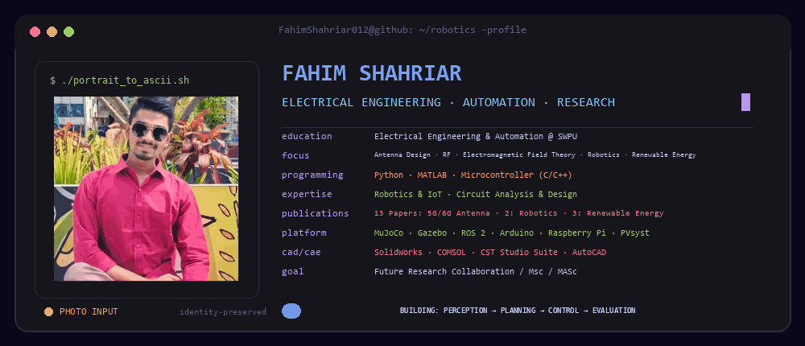

  

   

  
  
  
  
  

## `FahimShahriar012@github ~ $ whoami`

I am **Fahim Shahriar**, an Electrical Engineering & Automation student at Southwest Petroleum University. My work connects electrical engineering, automation, robotics, and applied research.

- **Research:** antenna design, RF, electromagnetic field theory, robotics, and renewable energy
- **Programming:** Python, MATLAB, and microcontroller development with C/C++
- **Engineering:** robotics and IoT, circuit analysis and design, simulation, and automation
- **Goal:** research collaboration and graduate study (MSc/MASc)

## `./research-focus --verbose`

| Area | Focus |
|---|---|
| **Wireless & Electromagnetics** | Antenna design, RF systems, 5G/6G technologies, and electromagnetic field theory |
| **Robotics & Automation** | Robotics, IoT, embedded systems, and automation-oriented engineering |
| **Energy** | Renewable-energy research and system-level applications |
| **Simulation & Design** | Modeling, analysis, CAD/CAE workflows, and reproducible technical work |

## `./stack --engineering`

### Programming & Embedded Development

### Robotics, Simulation & Engineering Tools

## `./research --highlights`

- Research across 5G/6G antennas, robotics, and renewable energy
- Work supported by ROS 2, Gazebo, MuJoCo, COMSOL, CST Studio Suite, and PVsyst
- Interested in projects that connect theory, simulation, embedded implementation, and real-world systems

## `./contributions.sh`

 

<picture>
  <source media="(prefers-color-scheme: dark)" srcset="./assets/github-contribution-grid-snake-dark.svg" />
  
</picture>

## `./github --activity`

## `./connect`

  

Profile artwork and contribution data are generated and refreshed by this repository's GitHub Actions workflow.

